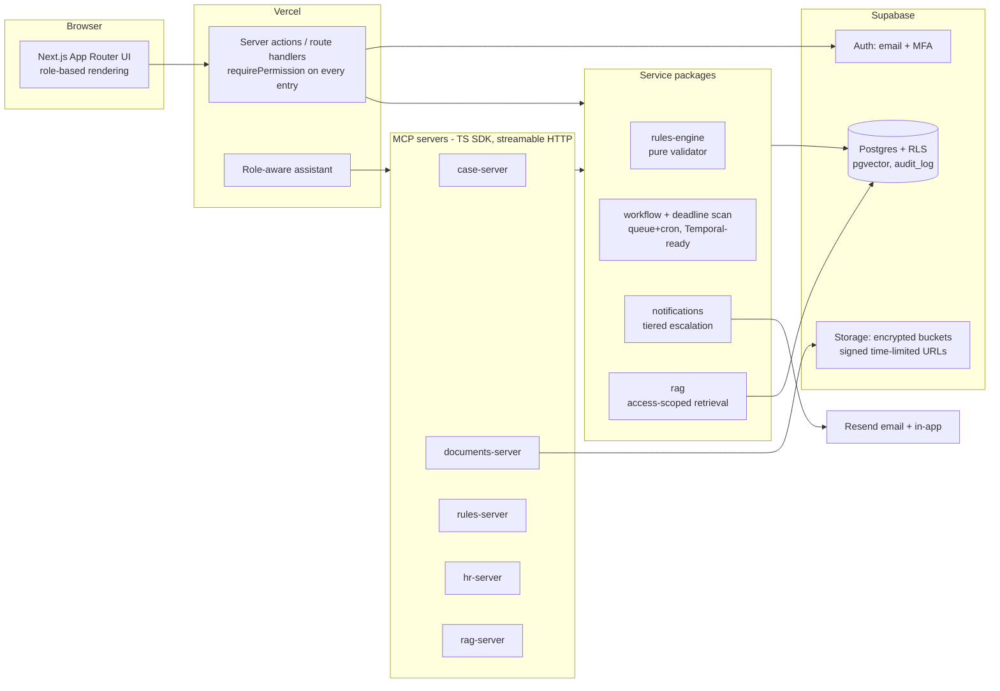

# HR & Immigration Lifecycle Platform — Master Build Plan

**Date:** 2026-07-06 · **Input:** [`BUILD_SPEC.md`](../BUILD_SPEC.md) · **Author:** Claude (Fable 5)

This is the execution plan for building the platform described in the spec. It is written to be executed by Claude Code using the subagents in `.claude/agents/` (created), the seed data in `data/immigration-seed/` (researched from official sources, counsel-pending), and the phase order in spec §13.3.

---

## 1. Executive summary

The spec describes two tightly-coupled domains — an HR employee-lifecycle system and an immigration case-management engine — over shared cross-cutting layers (RBAC+ABAC authorization, documents, notifications, RAG assistant via MCP, audit). The build strategy is **data-first, security-first, linear-path-first**:

1. **Data first.** All immigration law constants live in versioned data, never code. That data has already been researched from primary sources (USCIS, Federal Register, eCFR, DOL, State Dept) and adversarially verified — see §4. The rules engine is a pure interpreter over it.
2. **Security first.** Phase 1 delivers auth + RLS + encrypted documents before any feature code, because every later layer depends on `requirePermission()` and RLS being trustworthy. Nothing ships without server-side authorization.
3. **Linear path first.** Phase 3 implements the happy-path state machine (F-1 → OPT → H-1B → green card); Phase 4 adds the §7.4 edge cases and staffing compliance. This keeps the state machine testable at every step.

Six phases (0–5), each with a hard definition of done and a gating review by the `security-compliance` and `qa-testing` agents.

---

## 2. What this planning pass produced

| Artifact | Location | Status |
|---|---|---|
| Master build plan (this file) | `docs/BUILD_PLAN.md` | ✅ |
| 11 subagent definitions (spec §13.1) | `.claude/agents/*.md` | ✅ |
| Immigration seed data — 13 JSON files, web-researched + verified | `data/immigration-seed/` | ✅ (counsel-pending) |
| Seed data documentation & refresh procedure | `data/immigration-seed/README.md` | ✅ |

---

## 3. Spec gaps, assumptions & open decisions

**Spec gap:** §0(6) tells the builder to ask about "the four open decisions listed in §15" — but the spec has no §15. The four decisions most consistent with the document's own hedges are enumerated below with the defaults this plan proceeds on. Each default is reversible and will be noted in code comments per §0(6).

| # | Open decision | Default chosen | Rationale / escape hatch |
|---|---|---|---|
| D1 | **Workflow engine:** Temporal vs queue+cron | Start with **queue + cron on Supabase** (pg-backed job table + scheduled functions) behind a `DeadlineEngine`/`CaseWorkflow` interface | Spec §4 explicitly blesses the lighter start if the engine is separable. Temporal adds infra ops before there is any case volume. The interface is written so a Temporal adapter can replace the cron adapter in Phase 4+ without touching callers. |
| D2 | **E-signature for offer letters** | Built-in click-to-sign (typed name + timestamp + IP in `audit_log`), DocuSign adapter interface stubbed | Real e-sign providers need an account decision from the firm; click-to-sign is legally serviceable for offer letters and keeps Phase 2 self-contained. |
| D3 | **Email provider** | **Resend** | First-listed in spec §4/Appendix C, simplest API, easy to swap behind the notifications channel adapter. |
| D4 | **E-Verify integration** | **Manual**: HR enters the E-Verify case number; system enforces the 3-business-day timer | E-Verify Web Services API requires an enrollment/MOU process the firm must initiate; the data model stores `everify_case_id` either way. |

Additional standing assumptions:
- **Multi-tenant schema, single-tenant launch.** `org_id` on every row and RLS scoping from day one (per §6), but UI/provisioning assumes one organization until Admin org-management ships in Phase 4.
- **Volatile-rule risk is a design input.** The 2025–2026 changes (cap-gap → April 1, wage-weighted selection, $100k proclamation fee) are exactly the kind of litigation-exposed rules that flip after their effective date. The `rules` table's `superseded_by` chain + `effective_date` handles this; the UI must always render the "as-of / confirmed-by-counsel" indicator (§14).
- **LLM:** assistant and RAG generation route through **OpenRouter** (`OPENROUTER_API_KEY`, OpenAI-compatible chat-completions API at `https://openrouter.ai/api/v1`). The model is an env-configured slug (default a current Claude model, e.g. `anthropic/claude-sonnet-5`) so the firm can switch models without a deploy. Note: OpenRouter does not serve embeddings — RAG embeddings use a dedicated provider behind its own env var (e.g. `EMBEDDINGS_PROVIDER` / `EMBEDDINGS_API_KEY`).

---

## 4. Data foundation (already built — counsel-pending)

A multi-agent research workflow (9 web-research agents, each paired with an adversarial verifier that independently re-checked critical values against primary sources; 4 spec-derivation agents; 1 completeness auditor + gap fixer) produced `data/immigration-seed/`:

| File | Feeds | Refresh cadence |
|---|---|---|
| `statuses.json` | `statuses` table; state machine | On law change |
| `transitions.json` | State machine config | On law change |
| `document_requirements.json` | `document_requirements`; adaptive intake | On law/practice change |
| `notification_triggers.json` | Deadline engine config (Appendix B complete) | On law change |
| `rules_f1.json`, `rules_capgap.json`, `rules_h1b_cap.json`, `rules_h1b_mobility.json`, `rules_greencard.json`, `rules_i9_everify.json`, `uscis_fees.json` | `rules` table (versioned rows) | Quarterly + on announcement |
| `visa_bulletin_current.json` | `priority_date_tracking` reference | **Monthly** |
| `processing_times.json` | Operational defaults (not rules) | Monthly |

Load semantics (owned by `db-schema`):
- Loader is **idempotent** (`rule_id` natural key) and **append-only for changes**: a changed value inserts a new row and links `superseded_by`.
- Everything loads `confirmed_by_counsel=false`. Counsel ratification is a per-row, audited **database** action (admin UI in Phase 4), never a file edit.
- Rows whose `notes` begin with `UNVERIFIED:` surface first in the counsel-review queue.
- A scheduled **rules-freshness job** (Phase 3) flags `visa_bulletin_current` staleness > 35 days and `last_verified` staleness > 120 days on any rule that drives an active case.

---

## 5. Architecture blueprint

Key structural decisions:
- **`/packages/shared` is the contract layer**: zod schemas, permission helpers (`requirePermission`, `scopeFor`), and generated DB types. Server actions, MCP tools, and workers all import authorization from here — one enforcement implementation, three surfaces.
- **The rules engine is a pure function** `(caseSnapshot, rulesRows, today) → {eligibleTransitions, missingDocuments, violations, deadlines}` — no I/O, trivially table-testable, and reusable identically from server actions, MCP `rules_validate_case`, and the nightly scan.
- **The deadline engine is a separable service** (D1): `scan(now)` reads `case_dates` × `notification_triggers`, computes due reminders, writes idempotent `notifications` rows, and hands them to channel adapters.
- **RLS mirrors, never replaces, application authorization**: app-layer `requirePermission` is primary; RLS policies are the defense-in-depth backstop (§12), tested directly in Postgres.

Repository layout: exactly spec §5 (pnpm workspaces + turborepo).

---

## 6. Database plan (Phase 1, `db-schema`)

All §6 tables, with these emphases:

- **Identity/org:** `organizations`, `users`, `roles`, `user_roles` (with optional scope JSON: org/region/assigned-set), `permissions`, `role_permissions`. Roles/permissions are **rows** — adding Immigration Coordinator or Attorney later is an insert (§3.4).
- **Immigration:** `immigration_cases` (one per employee-track; `country_of_birth` for backlog logic), `statuses`, `case_transitions` (history incl. `receipt_number`, `decision`), `case_dates` (typed dates — the notification engine's sole input), `rules` (versioned; see §4), `priority_date_tracking`.
- **Employment/staffing:** `employees` (`employment_type`: `placement`|`direct_hire`), `clients`, `vendors`, `placements` (worksite **metro area** is a first-class column — it drives the amendment trigger §7.6).
- **HR:** `offer_letters`, `i9_records`, `w4_records` (encrypted payload), `policy_acknowledgments`, `benefits_enrollments`, `leave_requests`, `training_records`, `performance_reviews`, `offboarding`.
- **Cross-cutting:** `documents` (storage key + version + retention metadata), `document_requirements`, `helpdesk_tickets`, `rag_chunks` (embedding + access metadata), `notifications`, `audit_log` (append-only; INSERT-only grants + no UPDATE/DELETE policies).
- **Encryption:** SSN/W-4/passport fields encrypted at the application layer (AES-GCM via a `packages/shared` helper, key from env/KMS) *in addition to* at-rest encryption. Ciphertext columns are `bytea`; search on encrypted fields is not supported by design.
- **RLS strategy:** per-table policies deriving scope from `auth.uid()` → `user_roles`; deny-by-default; a `security definer` helper resolves the caller's permission set once per request. Every policy gets a positive and negative pgTAP test.

---

## 7. Rules engine & state machine (Phases 3–4, `immigration-rules`)

- **State machine as data:** statuses and transitions hydrate from the DB (seeded from `statuses.json`/`transitions.json`). Each transition carries preconditions (rule refs), required documents, timing window, responsible party — evaluated by the validator, not hard-coded.
- **Validator outputs are explainable:** every eligibility/violation result cites the `rule_id`s it used, so the UI can show "per rule X, effective Y, confirmed-by-counsel: no" (§14).
- **Clock calculators** as pure utilities: OPT 90-day / STEM 150-day unemployment clocks (calendar days from EAD start; cap-gap does not pause; STEM includes the 90), H-1B 6-year with recapture, 60-day grace clocks, AC21 one-year-to-file window, I-140 180-day withdrawal window, PERM 180-day validity.
- **Adaptive intake:** category selection → `document_requirements` resolution → branching form config for the frontend. Same resolver backs `docs_check_requirements` (MCP) and onboarding.
- **Edge-case order in Phase 4:** cap-gap → grace periods/offboarding clock → STEM reporting → AC21 + traps → portability/amendment (Simeio metro logic) → retrogression/concurrent filing/§106(c) → RFE/denial/re-file branches (generic per-transition sub-machine: `filed → receipt → [rfe → response] → approved|denied → [refile]`).

## 8. Deadline & notification engine (Phase 3, `workflow-notifications`)

- Nightly (+ on-demand) `scan(now)`: join `case_dates` × `notification_triggers` (all Appendix B types seeded) → due (date_type, offset, tier) tuples → idempotency check against `notifications` → channel adapters (Resend email, in-app; Slack/SMS interfaces stubbed).
- **Tiered escalation:** employee → HR → counsel, each tier joining at configured offsets; day-scale deadlines (I-9 §2, E-Verify, STEM 10-day/5-day reports, RFE) use day-level offsets.
- **Event triggers** in addition to date offsets: EAD start (starts unemployment clock), offboarding completion (starts grace clock, notifies HR/counsel), worksite-metro change (starts amendment workflow), priority date turning current (starts AC21 one-year clock).
- Simulated-clock integration tests gate the phase (fire exactly once per offset, idempotent re-scan, correct tier fan-out).

## 9. HR modules (Phase 2, `hr-modules`) — build order

1. Employee profiles + org scaffolding → 2. **Adaptive immigration intake** (form + document collection only; engine comes in Phase 3) → 3. **Offer letters** (docx/pdf skills; template → variables → file → click-to-sign D2) → 4. **I-9/W-4** (timers from rules data; encrypted W-4; E-Verify case-id capture D4; retention metadata) → 5. Policy acknowledgment → 6. Benefits enrollment → 7. Leave / training / reviews → 8. Helpdesk (tickets now, RAG in Phase 5) → 9. **Offboarding** (checklist + grace-clock trigger, completing the loop with §8-engine).

## 10. MCP servers (Phase 5, `mcp-servers`)

Per `mcp-builder` skill; build order `case-server` → `rules-server` → `documents-server` → `hr-server` → `rag-server`. Every tool: identity → permission set inside the handler; zod in/out schemas; `readOnlyHint`/`destructiveHint` annotations; evals per server including **authorization-denial cases** (employee calling another employee's case must fail with an actionable, non-leaky error).

## 11. RAG & assistant (Phase 5, `rag-assistant`)

Ingestion (policies, templates, case-visible docs) → chunking → pgvector with **access metadata on every chunk** → retrieval query filtered by caller's permission set server-side → generation with the legal guardrail system prompt (deadline/status answers OK; legal judgment → counsel-routing response, §14). Leak tests and guardrail refusal tests are DoD gates.

---

## 12. Phased execution plan

### Phase 0 — Scaffold (0.5 day equivalent) — *new, precedes spec Phase 1*
Monorepo (pnpm + turborepo) per §5 · CI skeleton (typecheck, lint, test) · Supabase + Vercel project provisioning (Appendix C) · env/secrets convention · `packages/shared` stub.
**DoD:** clean install + build + empty test run in CI; Supabase reachable.

### Phase 1 — Foundation (owners: db-schema, auth-rbac, security-compliance)
Full §6 schema + migrations + RLS · seed loader for `data/immigration-seed/` · Supabase Auth (email verify + MFA) · roles/permissions seed (4 roles) · `requirePermission` middleware · encrypted document store (signed URLs only) · `audit_log` + sensitive-access logging path.
**DoD (spec):** sign-up → role assignment works; RLS provably blocks cross-user access (pgTAP + integration tests); seed loads with `confirmed_by_counsel=false`.

### Phase 2 — HR core (owners: hr-modules, frontend)
Modules 1–6 + 9 from §9 above; onboarding checklist engine; I-9 timing enforced from rules data.
**DoD (spec):** a new hire onboards end-to-end with documents stored and I-9 timing enforced; security review passed.

### Phase 3 — Immigration engine + notifications (owners: immigration-rules, workflow-notifications)
State machine (linear path F-1 → OPT → H-1B → GC) · validator over versioned rules · `case_dates` population from intake · deadline scan + all Appendix B triggers + tiered escalation · rules-freshness job.
**DoD (spec):** a case advances through statuses; validator reports eligibility/violations from rules data alone; reminders fire on schedule (simulated-clock tests green).

### Phase 4 — Edge cases + staffing (owners: immigration-rules, workflow-notifications, hr-modules)
All §7.4 edge cases (order in §7 above) · placement compliance evidence (client letter, SOW, per-worksite LCA, itinerary) · **worksite-metro change → amended-petition workflow** · Employer/Admin full scoping + org management · counsel-ratification admin UI (per-row `confirmed_by_counsel` flip, audited) · Temporal adapter decision revisited (D1).
**DoD (spec):** every §7.4 edge case has passing tests; metro change triggers the amendment workflow.

### Phase 5 — RAG + assistant over MCP (owners: mcp-servers, rag-assistant, frontend)
Five MCP servers with evals · access-scoped retrieval · role-aware assistant UI · helpdesk-RAG integration · legal guardrails.
**DoD (spec):** employee assistant answers only from own scope; MCP tools authorize server-side; all evaluations pass.

**Cross-phase gates (spec §13.4):** server-side authz everywhere · rules as versioned data, zero immigration constants in code · Appendix B complete · PII encrypted + access-logged · all test suites green · no legal advice emitted.

---

## 13. Testing & CI strategy (qa-testing)

- **Unit:** rules validator (table-driven from seed JSON — the seed files are the fixtures), clock calculators (property tests around boundaries: day 89/90/91, day 149/150, April 1, 180 days), permission helpers.
- **DB:** pgTAP for every RLS policy (allow + deny), append-only audit constraint, encrypted-column round-trip.
- **Integration:** onboarding E2E, case lifecycle E2E, deadline scan under simulated clock, escalation ordering, idempotency.
- **MCP evals:** per mcp-builder guide, incl. authorization-denial and error-actionability cases.
- **Security abuse suite:** cross-tenant probes, signed-URL replay/expiry, MCP scope-escalation attempts, RAG leak probes, legal-advice guardrail probes.
- CI order: typecheck → lint → unit → pgTAP (ephemeral Postgres) → integration → evals; `security-compliance` review is a required check on phase-closing merges.

## 14. Risks & mitigations

| Risk | Mitigation |
|---|---|
| 2025–2026 rules (wage-weighted selection, $100k fee, cap-gap) flip via litigation | Versioned rows + `superseded_by` chains; freshness job; counsel queue prioritizes `UNVERIFIED:` rows; UI always shows as-of state |
| Seed data error drives a bad deadline | `confirmed_by_counsel=false` gates user-facing decisions; validator cites rule ids; counsel ratification required before go-live |
| RLS/app-authz drift | Same permission definitions generate both app checks and policy tests; abuse suite in CI |
| Cron-based engine misses a fire | Idempotent scan + catch-up on next run; scan-lag alert; Temporal migration path reserved (D1) |
| PII breach blast radius | App-layer encryption on top of at-rest; signed time-limited URLs; append-only audit of every sensitive access |
| Assistant crosses the legal-advice line | Guardrail prompt + refusal tests in CI; counsel-routing canned flow; MCP-only data access |

## 15. Immediate next steps

1. Counsel review kickoff: export the `UNVERIFIED:`-flagged and 2025–2026-changed rows from `data/immigration-seed/` as the first ratification batch.
2. Execute Phase 0 (scaffold), then Phase 1 with the `db-schema` and `auth-rbac` agents.
3. Stand up the monthly Visa Bulletin / processing-times refresh as a scheduled task once Phase 3's freshness job exists.
